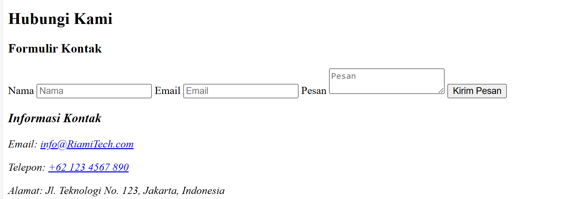

[](https://classroom.github.com/a/dyiPpHu0)


# Tech Company Profile RiamiTech

Ini adalah situs web Profil Perusahaan Teknologi sederhana yang dibuat menggunakan HTML dan CSS tanpa kerangka kerja apa pun. Ini memberikan gambaran umum tentang perusahaan teknologi dengan bagian seperti "Tentang Kami", "Layanan", dan "Kontak".

## Fitur

Adapun fitur pada website sebagai berikut:

- Structur Semantic HTML5
- Navbar
- List Layanan
- Kontak Form dengan variasi input data

## Setup dan Instalasi

1. **Clone Repository**  
   Clone Repositori ke dalam komputer anda:  
   ```bash  
   git clone https://github.com/revou-fsse-oct24/milestone-1-ridwanam9.git   
2. **Masuk Ke Projek**  
   Pindah ke directori project:  
   ```bash  
    cd milestone-1-ridwanam9.git   

3. **Buka di Browser**  
   Buka file index.html di browser web apa pun untuk melihat situs web:  
    ```plaintext
    Klik kanan pada index.html -> Buka dengan -> Browser Anda 

Alternatifnya, Anda dapat menggunakan ekstensi live server di editor kode Anda (misalnya, VS Code).

## Penggunaan

1. Sesuaikan konten dalam file index.html agar sesuai dengan profil perusahaan Anda.
2. Ubah gaya dalam file style.css untuk memperbarui tampilan dan nuansa situs web.
3. Tambahkan gambar atau file tambahan di folder aset (jika ada).

## Struktur Proyek

    ```
    /project-folder
    │
    ├── index.html                  # Halaman utamawebsite
    ├── style.css                   # File utama styling

    ├── /assets                     # Folder Gambar 
    │   ├── /images                 # Gambar Pengembanagn
    │   └── /image_documentations   # Gambar Dokumentasi
    │
    └── README.md                   # Dokumentasi proyek
    ```


## Kontribusi

Jika Anda ingin berkontribusi untuk meningkatkan proyek ini:

1. Fork repository ini.
2. Buat branch untuk perubahan Anda (git checkout -b feature-nama-fitur).
3. Commit perubahan Anda (git commit -m 'Menambahkan fitur X').
4. Push ke branch Anda (git push origin feature-nama-fitur).
5. Buat Pull Request.


# Tahap Pengembangan

1. Header


2. Hero Section


3. About Section


4. Services Section


5. Contact Section



6. Footer


> Note: Tampilan di atas belum termasuk styling dan mungkin membutuhkan pengembangan lebih lanjut.

